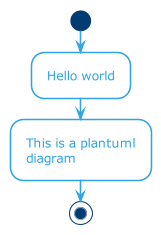

# Architecture document template

A template for documenting IT architecture.

## Goal

Architecture documents should be easily:

- accessible
- searchable
- reusable
- versionable.

With git, you automatically get a detailed history and change log of any document. It aligns well with the way of working of the development team, and more and more that of operations (see GitOps, Infrastructure as Code, Configuration as Code). Maintaining everything in adjacent git repos ensures better versioning and visibility.

## Prerequisites

- NPM ([installer](https://nodejs.org/en/download/))
- [graphviz](https://graphviz.org/) (on Mac: `brew install graphviz`)
- [plantuml](https://plantuml.com/) (on Mac: `brew install plantuml`)

Recommended: [VSCode](https://code.visualstudio.com/) with [PlantUML extension](https://marketplace.visualstudio.com/items?itemName=jebbs.plantuml).

## Included tooling

- [arc42](https://arc42.org/overview/) for the structure
- [docsify](https://docsify.js.org/#/) to generate a website
  - [Zoom plugin](https://docsify.now.sh/plugins?id=zoom-image)
  - [Edit on GitHub plugin](https://docsify.now.sh/plugins?id=edit-on-github)
  - [Docsify to PDF](https://www.npmjs.com/package/docsify-pdf-converter)
- [plantuml](https://plantuml.com/) for diagrams
- [ADR](https://adr.github.io/) (architectural decision records) for decisions
- [remark-lint](https://github.com/remarkjs/remark-lint) for linting markdown.

## Getting started

- Fork or clone this repository.
- Change the name and description of your project in the `docs/package.json`.
- Add the name of your project and the git repository in `docs/index.html`.
- Optionally change the ADR template in `lib/adr_template.md`.
- Do `npm install` from the `docs` directory.
- Run `npm run serve` to view the docsify website.

## How to use

To show the webpages in your browser, do `npm run serve`.

### Text

Just edit the contents of the files in the `docs` directory. Docsify does not need to rebuild anything to pick up the changes.

To lint, do `npm run lint` or, to check language, `npm run lint-language`

### Architecture decision

Add an ADR with `npm run adr "Name of decision"`. Edit the file in the `docs/adr` directory.

Run `npm run toc` to update the Table of Contents.

### Diagrams

Source and image outputs of diagrams are in `docs/diagrams`. [Plantuml](https://plantuml.com/) is ideal for simple visualizations
like sequence, class or deployment diagrams. A [theme](https://bschwarz.github.io/puml-themes/) is included in the `lib` directory.

For system context diagrams and high level component models, [C4](https://c4model.com/) is a clean and lightweight way of communicating
on the right level of depth. This repo includes an [extension](https://github.com/RicardoNiepel/C4-PlantUML) for plantuml.

After creating or updating diagram sources, run `npm run diagrams` to generate the png files.

### Export

To generate a PDF, do `npm run pdf`. It will be created in the `output` directory. See settings in `.docsifytopdfrc.js`.

## Credits

© We acknowledge that this document uses material from the arc 42
architecture template, <http://www.arc42.de>. Created by Dr. Peter
Hruschka & Dr. Gernot Starke.
